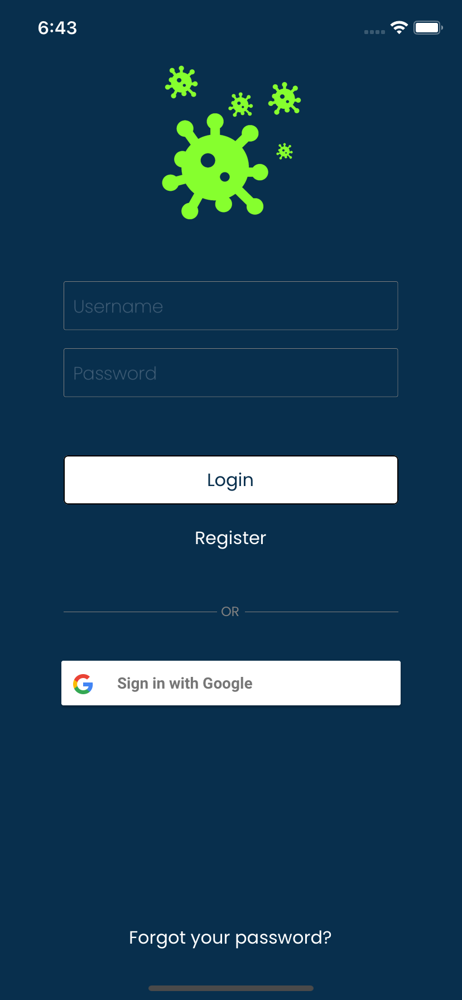
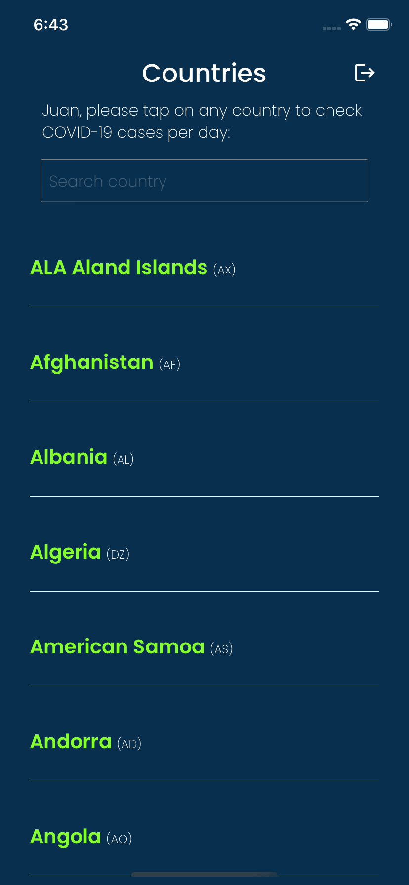
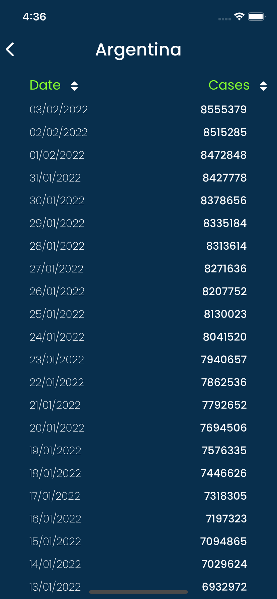

# Covid App

Covid App provides information about covid-19 cases per country. We use the following public API to display information in the app: 

https://api.covid19api.com

### How to run the app

1. Clone the repo: 
```sh
   git clone https://github.com/juanolmedo1/covid-app.git
```
 2. Install dependencies: 
```sh
   yarn install
 ```
 3. Install pods:
 ```sh
   npx pod-install
 ```
 4. Install the app locally:
  ```sh
   react-native run-ios
 ```
 
 ### Usage

You'll only be able to login via Google Sing In. 
Login, Register and Forgot password buttons were only added to improve the Login screen UI. (They have no functionality, yet :wink:) 

 ### Screenshots
 
 
 
 
